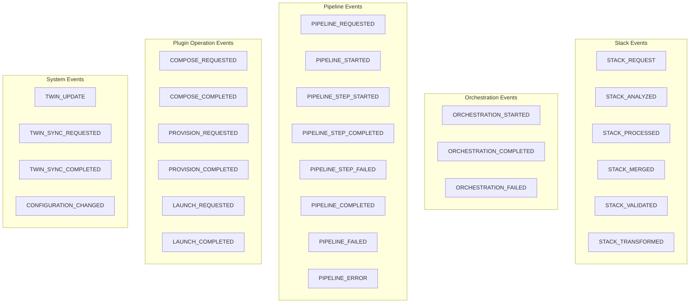
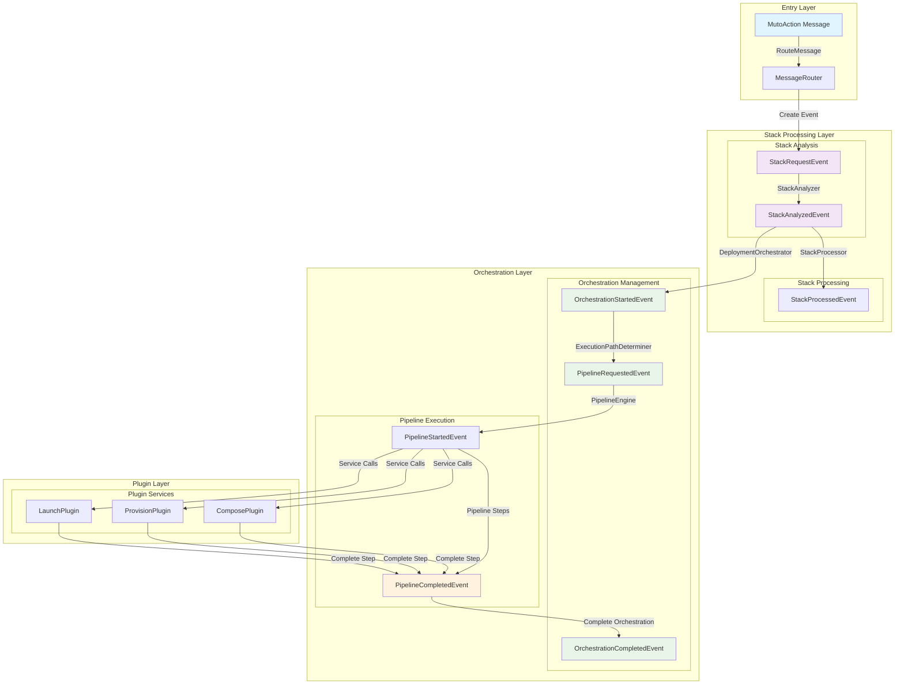
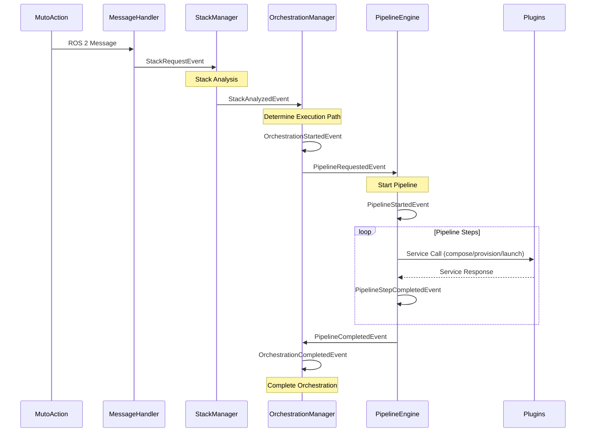
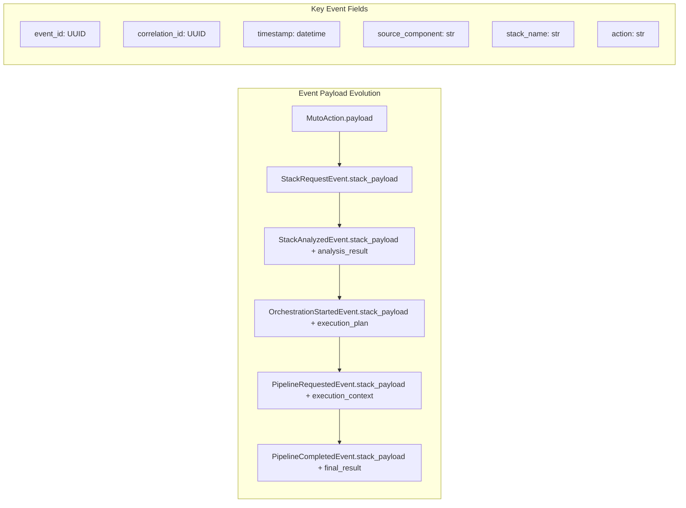

# Eclipse Muto Composer Architecture Reference

## **Document Overview**

This comprehensive reference document describes the current architecture, design patterns, and implementation details of the Eclipse Muto Composer system. The Composer has been successfully refactored from a monolithic design into a modular, event-driven architecture following modern software engineering principles.

## **Table of Contents**

- [Architecture Overview](#architecture-overview)
- [Core Design Principles](#core-design-principles)
- [System Components](#system-components)
- [Event-Driven Communication](#event-driven-communication)
- [Stack Processing Flow](#stack-processing-flow)
- [Pipeline Execution Engine](#pipeline-execution-engine)
- [Digital Twin Integration](#digital-twin-integration)
- [Configuration Management](#configuration-management)
- [Testing Strategy](#testing-strategy)
- [Extension Points](#extension-points)
- [Troubleshooting Guide](#troubleshooting-guide)

---

## **Architecture Overview**

### **High-Level System Design**

The Eclipse Muto Composer implements a **modular, event-driven architecture** where specialized subsystems coordinate through a centralized event bus. This design ensures loose coupling, high testability, and clear separation of concerns.

```
┌─────────────────────────────────────────────────────────────┐
│                    MutoComposer                             │
│            (Coordination & Integration Hub)                 │
└─────────────────────┬───────────────────────────────────────┘
                      │ Dependencies & Events
           ┌──────────┴──────────┐
           │                     │
┌──────────▼─────────┐ ┌─────────▼────────────────┐
│  MessageHandler    │ │  OrchestrationManager    │
│   Subsystem        │ │     Subsystem            │
│ • MessageRouter    │ │ • DeploymentOrchestrator │
│ • ServiceClientMgr │ │ • ExecutionPathDeterminer│
│ • PublisherManager │ │                          │
└──────────┬─────────┘ └─────────┬────────────────┘
           │                     │
┌──────────▼─────────┐ ┌─────────▼──────────┐
│   StackManager     │ │  PipelineEngine    │
│    Subsystem       │ │    Subsystem       │
│ • StackStateManager│ │ • PipelineManager  │
│ • StackAnalyzer    │ │ • PipelineExecutor │
│ • StackProcessor   │ │                    │
└──────────┬─────────┘ └─────────┬──────────┘
           │                     │
┌──────────▼─────────┐ ┌─────────▼──────────┐
│ DigitalTwinInte... │ │  Configuration     │
│    Subsystem       │ │     Management     │
│ • TwinServiceClient│ │                    │
│ • TwinSynchronizer │ │                    │
└────────────────────┘ └────────────────────┘
           │                     │
┌──────────▼─────────────────────▼──────────┐
│            EventBus System                │
│   (Centralized Communication Hub)         │
└───────────────────────────────────────────┘
```

### **Key Architectural Benefits**

- **Modularity**: Each subsystem has a single, well-defined responsibility
- **Testability**: Components can be unit tested in isolation
- **Extensibility**: New subsystems can be added without modifying existing code
- **Maintainability**: Clear boundaries reduce complexity and coupling
- **Reliability**: Event-driven communication provides better error isolation
- **Performance**: Asynchronous processing and pipeline optimization

---

## **Core Design Principles**

### **1. Single Responsibility Principle**
Each subsystem handles exactly one domain of functionality:
- **MessageHandler**: ROS 2 communication management
- **StackManager**: Stack state and transformation logic
- **OrchestrationManager**: Deployment workflow coordination
- **PipelineEngine**: Pipeline configuration and execution
- **DigitalTwinIntegration**: Twin service communication

### **2. Dependency Injection**
All subsystems receive dependencies through constructor injection, enabling:
- Easy testing with mock dependencies
- Clear dependency relationships
- Runtime configuration flexibility

```python
# Example dependency injection
class StackManager:
    def __init__(self, event_bus: EventBus, logger=None):
        self.event_bus = event_bus
        self.logger = logger
        # Initialize components with injected dependencies
```

### **3. Event-Driven Communication**
Subsystems communicate through well-defined events, providing:
- Loose coupling between components
- Asynchronous processing capabilities
- Clear audit trail of system operations
- Easy addition of new event handlers

### **4. Configuration-Driven Behavior**
System behavior is controlled through external configuration:
- Pipeline definitions in YAML
- ROS 2 parameters for runtime configuration
- Environment-specific settings
- Plugin-based extensibility

---

## **System Components**

### **MutoComposer (Main Coordinator)**

**File**: `src/composer/composer/muto_composer.py`

**Purpose**: Lightweight coordination hub that orchestrates interactions between specialized subsystems.

**Key Responsibilities**:
- Initialize and configure all subsystems with proper dependencies
- Coordinate high-level workflow between subsystems
- Handle ROS 2 node lifecycle management
- Provide unified logging and error handling
- Manage component dependencies and startup/shutdown sequences

**Core Implementation**:
```python
class MutoComposer(Node):
    def __init__(self):
        super().__init__("muto_composer")
        
        # Configuration setup
        self._setup_parameters()
        
        # Initialize event bus for subsystem communication
        self.event_bus = EventBus()
        self.event_bus.set_logger(self.get_logger())
        
        # Initialize subsystems with dependency injection
        self._initialize_subsystems()
        
        # Set up ROS 2 interfaces
        self._setup_ros_interfaces()
        
        # Subscribe to coordination events
        self._subscribe_to_events()
```

**Event Subscriptions**:
- `PIPELINE_COMPLETED`: Coordinates successful pipeline completion
- `PIPELINE_FAILED`: Handles pipeline failure and error recovery

---

### **MessageHandler Subsystem**

**File**: `src/composer/composer/subsystems/message_handler.py`

**Purpose**: Centralized management of all ROS 2 communication including topics, services, and publishers.

**Components**:

#### **MessageRouter**
Routes incoming messages to appropriate handlers via events:
```python
class MessageRouter:
    def route_muto_action(self, action: MutoAction) -> None:
        """Route MutoAction to orchestration manager via events."""
        payload = json.loads(action.payload)
        event = StackRequestEvent(
            event_type=EventType.STACK_REQUEST,
            source_component="message_router",
            stack_name=self._extract_stack_name(payload),
            action=action.method,
            stack_payload=payload
        )
        self.event_bus.publish_sync(event)
```

#### **ServiceClientManager**
Manages CoreTwin service communication:
```python
class ServiceClientManager:
    def __init__(self, node: Node, core_twin_node_name: str = "core_twin"):
        self.node = node
        self.get_stack_client = node.create_client(
            CoreTwin, 
            f"{core_twin_node_name}/get_stack_definition"
        )
        self.set_stack_client = node.create_client(
            CoreTwin, 
            f"{core_twin_node_name}/set_current_stack"
        )
    
    async def get_stack_definition(self, stack_id: str) -> Optional[Dict[str, Any]]:
        """Retrieve stack definition from twin service."""
```

#### **MessageHandler (Main Coordinator)**
Main message handling subsystem that coordinates all ROS 2 communication:
```python
class MessageHandler:
    def __init__(self, node: Node, event_bus: EventBus, core_twin_node_name: str = "core_twin"):
        self.node = node
        self.event_bus = event_bus
        
        # Initialize components
        self.router = MessageRouter(event_bus, self.logger)
        self.publisher_manager = PublisherManager(node)
        self.service_manager = ServiceClientManager(node, core_twin_node_name)
        
        # Set up subscribers
        self._setup_subscribers()
    
    def _muto_action_callback(self, msg: MutoAction):
        """Callback for MutoAction messages."""
        self.router.route_muto_action(msg)
```

**Key Features**:
- Unified coordination of all ROS 2 communication components
- Automatic message routing based on message type
- Consolidated publisher management (removes deprecated publishers)
- Service availability checking and connection management

---

### **StackManager Subsystem**

**File**: `src/composer/composer/subsystems/stack_manager.py`

**Purpose**: Specialized management of stack states, analysis, and transformations.

**Components**:

#### **StackStateManager**
Manages current and next stack states:
```python
class StackStateManager:
    def __init__(self, event_bus: EventBus, logger=None):
        self.current_stack: Optional[Dict] = None
        self.next_stack: Optional[Dict] = None
        self.event_bus = event_bus
        
        # Subscribe to relevant events
        self.event_bus.subscribe(EventType.STACK_MERGED, self.handle_stack_merged)
```

#### **StackAnalyzer**
Provides stack type enumeration and execution requirements structure:
```python
class StackType(Enum):
    """Enumeration of stack types."""
    ARCHIVE = "stack/archive"
    JSON = "stack/json" 
    RAW = "stack/raw"
    LEGACY = "stack/legacy"
    UNKNOWN = "stack/unknown"

@dataclass
class ExecutionRequirements:
    """Stack execution requirements."""
    requires_provision: bool = False
    requires_launch: bool = False
    has_nodes: bool = False
    has_composables: bool = False
    has_launch_description: bool = False
```

**Note**: The actual stack analysis logic is implemented in the `ExecutionPathDeterminer` within the OrchestrationManager subsystem.

#### **StackProcessor**
Handles stack transformations, merging, and expression resolution:
```python
class StackProcessor:
    def merge_stacks(self, current: Dict, next: Dict) -> Dict:
        """Intelligent stack merging using the Stack model."""
        if not current:
            current = {}
        
        stack_1 = Stack(manifest=current)
        stack_2 = Stack(manifest=next)
        merged = stack_1.merge(stack_2)
        
        # Publish merge completion event
        self.event_bus.publish_sync(StackMergedEvent(...))
        return merged.manifest
    
    def resolve_expressions(self, stack_manifest: Dict) -> Dict:
        """Resolve dynamic expressions in stack manifest."""
        # Recursive expression resolution logic
```

**Stack Type Detection**:
- **Archive**: `content_type: "stack/archive"` - requires provisioning
- **JSON**: `content_type: "stack/json"` - direct launch capability
- **Raw**: Contains `node` or `composable` definitions
- **Legacy**: Contains `launch_description_source` or `on_start`/`on_kill`

---

### **OrchestrationManager Subsystem**

**File**: `src/composer/composer/subsystems/orchestration_manager.py`

**Purpose**: Coordinates deployment workflows and manages the orchestration lifecycle.

**Components**:

#### **ExecutionPathDeterminer**
Determines execution path based on stack analysis (contains the actual stack analysis logic):
```python
class ExecutionPathDeterminer:
    def determine_path(self, analyzed_event: StackAnalyzedEvent, 
                      current_stack: Optional[Dict] = None,
                      next_stack: Optional[Dict] = None) -> ExecutionPath:
        """Determine execution path and context variables."""
        
        # Extract stack characteristics
        stack_payload = analyzed_event.stack_payload
        stack_type = analysis_result.get("stack_type", StackType.UNKNOWN.value)
        
        # Complex analysis logic to determine:
        # - should_run_provision
        # - should_run_launch  
        # - requires_merging
        
        # Archive stacks require provision + launch
        if stack_type == StackType.ARCHIVE.value:
            should_run_provision = True
            should_run_launch = True
            requires_merging = False
        
        # JSON stacks require launch + merging
        elif stack_type == StackType.JSON.value:
            should_run_provision = False
            should_run_launch = True
            requires_merging = True
        
        # Additional conditional logic...
        
        return ExecutionPath(
            pipeline_name=analyzed_event.action,
            context_variables={"should_run_provision": should_run_provision, 
                             "should_run_launch": should_run_launch},
            requires_merging=requires_merging
        )
```

#### **DeploymentOrchestrator**
Manages the complete deployment lifecycle:
```python
class DeploymentOrchestrator:
    def start_orchestration(self, stack_name: str, action: str, requirements: ExecutionRequirements):
        """Start orchestration process based on stack analysis."""
        orchestration_id = str(uuid.uuid4())
        
        self._active_orchestrations[orchestration_id] = {
            "stack_name": stack_name,
            "action": action,
            "status": "started",
            "requirements": requirements,
            "start_time": time.time()
        }
        
        # Determine and execute appropriate pipeline
        if requirements.requires_provision and requirements.requires_launch:
            pipeline_name = "apply"
        elif requirements.requires_launch:
            pipeline_name = "start"
        else:
            pipeline_name = "kill"
        
        # Request pipeline execution
        self.event_bus.publish_sync(PipelineRequestedEvent(...))
```

**Key Features**:
- Tracks active orchestrations with unique IDs
- Determines appropriate pipeline based on stack analysis
- Coordinates between analysis, processing, and pipeline execution
- Provides orchestration status tracking and logging

---

### **PipelineEngine Subsystem**

**File**: `src/composer/composer/subsystems/pipeline_engine.py`

**Purpose**: Manages pipeline configuration, execution, and coordination with plugin services.

**Components**:

#### **PipelineManager**
Loads and manages pipeline configurations:
```python
class PipelineManager:
    def __init__(self, config_path: str = None):
        if not config_path:
            config_path = os.path.join(
                get_package_share_directory('composer'),
                'config', 'pipeline.yaml'
            )
        self.pipelines = self._load_pipeline_config(config_path)
    
    def get_pipeline(self, name: str) -> Optional[Dict]:
        """Get pipeline configuration by name."""
        return self.pipelines.get(name)
```

#### **PipelineExecutor**
Executes pipeline steps and coordinates with plugin services:
```python
class PipelineExecutor:
    def execute_pipeline(self, pipeline_name: str, context: Dict = None):
        """Execute a pipeline with proper step coordination."""
        pipeline = self.pipeline_manager.get_pipeline(pipeline_name)
        
        for step in pipeline.get('steps', []):
            # Execute step with proper error handling
            success = self._execute_step(step, context)
            if not success and step.get('critical', True):
                raise PipelineExecutionError(f"Critical step failed: {step['name']}")
```

**Pipeline Configuration** (`config/pipeline.yaml`):
```yaml
apply:
  steps:
    - name: compose_step
      plugin: ComposePlugin
      service: muto_compose_stack
      critical: false
    - name: provision_step
      plugin: ProvisionPlugin
      service: muto_provision_stack
      condition: should_run_provision == True
    - name: apply_stack_step
      plugin: LaunchPlugin
      service: muto_apply_stack
```

**Pipeline Types**:
- **apply**: Complete deployment (compose → provision → launch)
- **start**: Launch-only pipeline
- **kill**: Termination pipeline

---

### **DigitalTwinIntegration Subsystem**

**File**: `src/composer/composer/subsystems/digital_twin_integration.py`

**Purpose**: Manages communication with digital twin services and stack definition synchronization.

**Components**:

#### **TwinServiceClient**
Handles CoreTwin service interactions:
```python
class TwinServiceClient:
    async def get_stack_definition(self, name: str) -> Optional[str]:
        """Retrieve stack definition from digital twin."""
        request = CoreTwin.Request()
        request.name = name
        
        try:
            response = await self.twin_client.call_async(request)
            return response.definition if response.success else None
        except Exception as e:
            self.logger.error(f"Twin service call failed: {e}")
            return None
```

#### **TwinSynchronizer**
Synchronizes stack states with digital twin:
```python
class TwinSynchronizer:
    def sync_current_stack(self, stack: Dict):
        """Synchronize current stack state with digital twin."""
        # Convert stack to appropriate format and update twin
```

---

## **Event-Driven Communication**

### **Event Bus System**

**File**: `src/composer/composer/events.py`

The event bus provides the communication backbone for the entire system:

```python
class EventBus:
    def __init__(self):
        self._subscribers = defaultdict(list)
        self._logger = None
    
    def publish_sync(self, event: BaseComposeEvent):
        """Publish event synchronously to all subscribers."""
        event_type = event.event_type
        subscribers = self._subscribers.get(event_type, [])
        
        for subscriber in subscribers:
            try:
                subscriber(event)
            except Exception as e:
                if self._logger:
                    self._logger.error(f"Event handler error: {e}")
    
    def subscribe(self, event_type: str, handler: callable):
        """Subscribe to events of a specific type."""
        self._subscribers[event_type].append(handler)
```

### **Event Types and Flow**

#### **Event Type Hierarchy**



#### **Primary Event Flow - Layered Architecture**



#### **Detailed Event Flow Sequence**



#### **Event Data Flow**



**Primary Event Flow**:
```
MutoAction → StackRequestEvent → StackAnalyzedEvent → OrchestrationStartedEvent 
→ PipelineRequestedEvent → PipelineCompletedEvent → OrchestrationCompletedEvent
```

**Event Definitions**:

```python
class BaseComposeEvent:
    """Base class for all composer events."""
    def __init__(self, event_type: EventType, source_component: str, 
                 event_id: Optional[str] = None, 
                 correlation_id: Optional[str] = None,
                 metadata: Optional[Dict[str, Any]] = None,
                 stack_payload: Optional[Dict[str, Any]] = None,
                 stack_name: Optional[str] = None,
                 action: Optional[str] = None,
                 pipeline_name: Optional[str] = None,
                 orchestration_id: Optional[str] = None):
        # Event implementation using constructor parameters

class StackRequestEvent(BaseComposeEvent):
    """Initial request to process a stack."""
    # Inherits from BaseComposeEvent with stack_name, action, stack_payload

class StackAnalyzedEvent(BaseComposeEvent):
    """Stack analysis completed with execution requirements."""
    # Additional fields: analysis_result, processing_requirements

class PipelineCompletedEvent(BaseComposeEvent):
    """Pipeline execution completed successfully."""
    # Additional fields: execution_id, final_result
```

**Event Type Enumeration**:
```python
class EventType(Enum):
    # Stack Events
    STACK_REQUEST = "stack.request"
    STACK_ANALYZED = "stack.analyzed"
    STACK_PROCESSED = "stack.processed"
    STACK_MERGED = "stack.merged"
    
    # Orchestration Events  
    ORCHESTRATION_STARTED = "orchestration.started"
    ORCHESTRATION_COMPLETED = "orchestration.completed"
    
    # Pipeline Events
    PIPELINE_REQUESTED = "pipeline.requested"
    PIPELINE_COMPLETED = "pipeline.completed"
    PIPELINE_FAILED = "pipeline.failed"
    
    # And more...
```

---

## **Stack Processing Flow**

### **Complete Processing Lifecycle**

1. **Message Reception** (MessageHandler)
   - ROS 2 MutoAction message received
   - MessageRouter extracts payload and creates StackRequestEvent
   - Event published to EventBus

2. **Stack Analysis** (StackManager)
   - StackAnalyzer determines stack type and execution requirements
   - StackAnalyzedEvent published with analysis results

3. **Orchestration Start** (OrchestrationManager)
   - DeploymentOrchestrator receives analysis and starts orchestration
   - Determines appropriate pipeline based on requirements
   - OrchestrationStartedEvent published

4. **Stack Processing** (StackManager)
   - StackProcessor handles merging and expression resolution
   - StackProcessedEvent published with processed manifest

5. **Pipeline Execution** (PipelineEngine)
   - PipelineExecutor runs appropriate pipeline (apply/start/kill)
   - Each pipeline step coordinates with plugin services
   - PipelineCompletedEvent published on success

6. **Orchestration Completion** (OrchestrationManager)
   - DeploymentOrchestrator finalizes orchestration
   - OrchestrationCompletedEvent published

### **Error Handling and Recovery**

```python
# Example error handling in pipeline execution
try:
    success = self._execute_step(step, context)
    if not success and step.get('critical', True):
        # Publish failure event
        self.event_bus.publish_sync(PipelineFailedEvent(
            pipeline_name=pipeline_name,
            failed_step=step['name'],
            error_details=error_message
        ))
except Exception as e:
    # Handle unexpected errors
    self._handle_pipeline_error(pipeline_name, step, e)
```

---

## **Pipeline Execution Engine**

### **Pipeline Configuration Structure**

Pipelines are defined in YAML configuration with the following structure:

```yaml
pipelines:
  - name: pipeline_name
    pipeline:
      steps:
        - name: step_name
          plugin: PluginClassName
          service: ros_service_name
          critical: true|false
          condition: "conditional_expression"
          timeout: seconds
    compensation:
      # Optional compensation steps
```

**Example Configuration** (`config/pipeline.yaml`):
```yaml
pipelines:
  - name: apply
    pipeline:
      steps:
        - name: compose_step
          plugin: ComposePlugin
          service: muto_compose_stack
          critical: false
        - name: provision_step
          plugin: ProvisionPlugin
          service: muto_provision_stack
          condition: should_run_provision == True
        - name: apply_stack_step
          plugin: LaunchPlugin
          service: muto_apply_stack
```

### **Plugin Service Integration**

The pipeline engine coordinates with three main plugin services:

#### **ComposePlugin** (`muto_compose_stack`)
- Handles stack composition and validation
- Optional step (critical: false)
- Used for stack merging and preparation

#### **ProvisionPlugin** (`muto_provision_stack`)
- Provisions archive-based stacks
- Conditional execution based on stack type
- Handles workspace setup and build processes

#### **LaunchPlugin** (`muto_apply_stack` / `muto_start_stack`)
- Launches stack components
- Primary execution step for most pipelines
- Manages ROS 2 launch processes

### **ROS 2 Service Integration Patterns**

The actual service integration uses ROS 2 patterns with proper callback groups and service availability checking:

```python
class ServiceClientManager:
    def __init__(self, node: Node, core_twin_node_name: str = "core_twin"):
        # Initialize service clients with proper service names
        self.get_stack_client = node.create_client(
            CoreTwin, 
            f"{core_twin_node_name}/get_stack_definition"
        )
        
    async def get_stack_definition(self, stack_id: str) -> Optional[Dict[str, Any]]:
        """Retrieve stack definition with service availability checking."""
        try:
            request = CoreTwin.Request()
            request.input = stack_id
            
            # Check service availability with timeout
            if not self.get_stack_client.wait_for_service(timeout_sec=5.0):
                self.logger.error("CoreTwin service not available")
                return None
            
            # Use future-based async pattern
            future = self.get_stack_client.call_async(request)
            # Note: In practice, this integrates with ROS 2 executor patterns
            
            return {}  # Processed response
            
        except Exception as e:
            self.logger.error(f"Service call failed: {e}")
            return None
```

### **Digital Twin Integration with Callback Groups**

```python
class TwinServiceClient:
    def __init__(self, node: Node, event_bus: EventBus, logger=None):
        # Use ReentrantCallbackGroup for service calls
        self.callback_group = ReentrantCallbackGroup()
        
        self.core_twin_client = self.node.create_client(
            CoreTwin,
            '/core_twin/get_stack_definition',
            callback_group=self.callback_group
        )
```

### **Pipeline Execution Context**

```python
# Example execution context passed to plugins
execution_context = {
    "stack_manifest": processed_stack,
    "execution_requirements": requirements,
    "orchestration_id": orchestration_id,
    "metadata": {
        "timestamp": time.time(),
        "requester": "composer",
        "pipeline_name": pipeline_name
    }
}
```

### **Plugin Development Guide**

#### **Plugin Architecture Overview**

Pipeline plugins are ROS 2 nodes that implement specific pipeline steps using a standardized service-based interface. Each plugin handles one specific operation type (compose, provision, launch) and follows consistent patterns for integration with the pipeline engine.

**Core Plugin Patterns:**
- **ROS 2 Node**: Each plugin extends `rclpy.node.Node`
- **Service Interface**: Plugins expose ROS 2 services for pipeline interaction
- **Payload Processing**: Standardized stack manifest and payload handling
- **Error Handling**: Consistent success/failure response patterns
- **Logging**: Structured logging for debugging and monitoring

#### **Plugin Base Structure**

All plugins follow this foundational structure:

```python
from rclpy.node import Node
from muto_msgs.srv import PluginService

class MutoPluginBase(Node):
    def __init__(self, node_name: str, service_name: str):
        super().__init__(node_name)
        
        # Create service for pipeline integration
        self.service = self.create_service(PluginService, service_name, self.handle_request)
        self.current_stack = None
    
    def handle_request(self, request, response):
        """Main service handler - implement plugin logic here."""
        try:
            if request.start:
                # Execute plugin-specific logic
                result = self.execute_plugin_logic(request)
                response.success = result['success']
                response.err_msg = result['message']
            # Handle error cases...
        except Exception as e:
            response.success = False
            response.err_msg = f"Error: {e}"
        
        response.output.current = request.input.current
        return response
    
    def execute_plugin_logic(self, request):
        """Override this method to implement plugin-specific logic."""
        raise NotImplementedError()
```

#### **Plugin Implementation Patterns**

**1. Compose Plugin Pattern** (Stack Processing):

```python
from muto_msgs.srv import ComposePlugin

class MutoDefaultComposePlugin(Node):
    def __init__(self):
        super().__init__("compose_plugin")
        
        # Service for composition requests
        self.compose_srv = self.create_service(ComposePlugin, "muto_compose", self.handle_compose)
        
        # Stack processing utilities
        self.stack_parser = StackParser(self.get_logger())
        self.stack_pub = self.create_publisher(StackManifest, "composed_stack", 10)
    
    def handle_compose(self, request, response):
        """Handle stack composition requests."""
        if request.start:
            stack_dict = self._safely_parse_stack(request.input.current.stack)
            if stack_dict:
                composed_stack = self.compose_stack(stack_dict)
                # Publish composed stack...
                response.success = True
            # Handle error cases...
        return response
```

**2. Provision Plugin Pattern** (Workspace Management):

```python
from muto_msgs.srv import ProvisionPlugin

class MutoProvisionPlugin(Node):
    def __init__(self):
        super().__init__("provision_plugin")
        
        # Service for provisioning requests
        self.provision_srv = self.create_service(ProvisionPlugin, "muto_provision", self.handle_provision)
        
        # Workspace management
        self.workspaces_path = os.path.join("/tmp", "muto", "muto_workspaces")
        self.declare_parameter("ignored_packages", [""])
    
    def handle_provision(self, request, response):
        """Handle workspace provisioning requests."""
        if request.start:
            self.current_stack = self._safely_parse_stack(request.input.current.stack)
            content_type = self.current_stack.get("metadata", {}).get("content_type")
            
            if content_type == "stack/archive":
                self.from_archive(self.current_stack)
            elif request.input.current.url:
                self.from_git(request.input.current.url, request.input.current.branch)
            
            # Build workspace if needed...
            response.success = True
        return response
```

**3. Launch Plugin Pattern** (Process Management):

```python
from muto_msgs.srv import LaunchPlugin
from rclpy.callback_groups import ReentrantCallbackGroup

class MutoDefaultLaunchPlugin(Node):
    def __init__(self):
        super().__init__("launch_plugin")
        
        # Use reentrant callback group for concurrent service calls
        self.callback_group = ReentrantCallbackGroup()
        
        # Multiple services for different launch operations
        self.start_srv = self.create_service(LaunchPlugin, "muto_start_stack", self.handle_start)
        self.kill_srv = self.create_service(LaunchPlugin, "muto_kill_stack", self.handle_kill)
        self.apply_srv = self.create_service(LaunchPlugin, "muto_apply_stack", self.handle_apply)
        
        # Process management
        self.running_processes = {}
    
    def handle_start(self, request, response):
        """Handle stack start requests."""
        return self._handle_launch_request(request, response, "start")
    
    def _handle_launch_request(self, request, response, operation):
        """Common handler for all launch operations."""
        if request.start:
            stack_dict = self._safely_parse_stack(request.input.current.stack)
            result = self._execute_launch_operation(stack_dict, operation)
            response.success = result['success']
        return response
```

#### **Plugin Development Best Practices**

**1. Error Handling Pattern:**
```python
def handle_request(self, request, response):
    try:
        # Plugin logic here
        response.success = True
        response.err_msg = "Success"
    except Exception as e:
        self.get_logger().error(f"Plugin error: {e}")
        response.success = False
        response.err_msg = f"Error: {e}"
    
    # Always echo input to output for pipeline continuity
    response.output.current = request.input.current
    return response
```

**2. Stack Parsing Utility:**
```python
def _safely_parse_stack(self, stack_string):
    """Standard pattern for safe stack parsing."""
    if not stack_string:
        return None
    try:
        parsed = json.loads(stack_string)
        return parsed if isinstance(parsed, dict) else None
    except (json.JSONDecodeError, TypeError):
        return None
```

**3. Payload Type Detection:**
```python
def _detect_payload_type(self, stack_dict):
    """Determine stack type for appropriate handling."""
    if not stack_dict:
        return "unknown"
    
    metadata = stack_dict.get("metadata", {})
    content_type = metadata.get("content_type", "")
    
    if content_type == "stack/archive":
        return "archive"
    elif "launch" in stack_dict:
        return "launch_manifest"
    else:
        return "json"
```

#### **Plugin Testing Template**

```python
import pytest
import rclpy
from your_plugin import YourPlugin

class TestYourPlugin:
    def setup_method(self):
        rclpy.init()
        self.plugin = YourPlugin()
    
    def test_successful_request(self):
        request = ServiceType.Request()
        request.start = True
        request.input.current.stack = json.dumps({"test": "data"})
        
        response = ServiceType.Response()
        result = self.plugin.handle_request(request, response)
        
        assert result.success == True
    
    def test_parse_error_handling(self):
        request = ServiceType.Request()
        request.start = True
        request.input.current.stack = "invalid json"
        
        response = ServiceType.Response()
        result = self.plugin.handle_request(request, response)
        
        assert result.success == False
```

#### **Plugin Registration and Configuration**

To integrate a new plugin into the pipeline system:

**1. Pipeline Configuration:**
```yaml
# config/pipeline.yaml
pipelines:
  - name: custom_pipeline
    pipeline:
      steps:
        - name: your_plugin_step
          plugin: YourPluginClass
          service: your_plugin_service
          critical: true
          timeout: 30
```

**2. Launch File Integration:**
```python
# Add to launch file
your_plugin = Node(
    package='your_package',
    executable='your_plugin',
    name='your_plugin'
)
```

**3. Package Dependencies:**
```xml
<!-- package.xml -->
<depend>rclpy</depend>
<depend>muto_msgs</depend>
<depend>composer</depend>
```

---

## **Configuration Management**

### **ROS 2 Parameters**

The composer accepts the following ROS 2 parameters:

```python
# Parameter declarations in MutoComposer.__init__()
self.declare_parameter("stack_topic", "stack")
self.declare_parameter("twin_url", "sandbox.composiv.ai")
self.declare_parameter("namespace", "org.eclipse.muto.sandbox")
self.declare_parameter("name", "example-01")
```

### **Pipeline Configuration**

Pipeline definitions are loaded from:
```
{package_share}/composer/config/pipeline.yaml
```

### **Environment Configuration**

Environment-specific settings can be configured through:
- ROS 2 parameter files
- Environment variables
- Launch file arguments

---

## **Testing Strategy**

### **Unit Testing Approach**

Each subsystem can be tested in isolation using dependency injection:

```python
# Example unit test setup for ExecutionPathDeterminer
class TestExecutionPathDeterminer:
    def setup_method(self):
        self.path_determiner = ExecutionPathDeterminer()
    
    def test_archive_stack_execution_path(self):
        analyzed_event = StackAnalyzedEvent(
            event_type=EventType.STACK_ANALYZED,
            source_component="test",
            analysis_result={"stack_type": StackType.ARCHIVE.value},
            action="apply",
            stack_payload={"metadata": {"content_type": "stack/archive"}}
        )
        
        execution_path = self.path_determiner.determine_path(analyzed_event)
        assert execution_path.context_variables["should_run_provision"] == True
        assert execution_path.context_variables["should_run_launch"] == True

# Example MessageHandler testing with mock ROS 2 node
class TestMessageHandler:
    def setup_method(self):
        self.mock_node = MockNode()
        self.event_bus = EventBus()
        self.message_handler = MessageHandler(
            node=self.mock_node,
            event_bus=self.event_bus
        )
    
    def test_muto_action_routing(self):
        action = MutoAction()
        action.method = "apply"
        action.payload = '{"metadata": {"content_type": "stack/json"}}'
        
        self.message_handler.handle_muto_action(action)
        
        # Verify event was published
        assert self.event_bus.last_published_event.event_type == EventType.STACK_REQUEST
```

### **Integration Testing**

Integration tests verify event flow between subsystems using actual ROS 2 patterns:

```python
def test_complete_stack_processing_flow():
    # Setup MutoComposer with real subsystems
    composer = MutoComposer()
    
    # Create test MutoAction message
    action = MutoAction()
    action.method = "apply" 
    action.payload = json.dumps({
        "metadata": {"content_type": "stack/archive"},
        "launch": {"data": "test_data"}
    })
    
    # Track events through the system
    event_tracker = EventTracker()
    composer.event_bus.add_listener(event_tracker.track_event)
    
    # Simulate message processing
    composer.on_stack_callback(action)
    
    # Verify complete event flow
    assert event_tracker.was_published(EventType.STACK_REQUEST)
    assert event_tracker.was_published(EventType.STACK_ANALYZED)
    assert event_tracker.was_published(EventType.ORCHESTRATION_STARTED)
    assert event_tracker.was_published(EventType.PIPELINE_REQUESTED)

# Test subsystem integration
def test_orchestration_manager_integration():
    event_bus = EventBus()
    orchestration_manager = OrchestrationManager(event_bus)
    
    # Simulate analyzed stack event
    analyzed_event = StackAnalyzedEvent(
        event_type=EventType.STACK_ANALYZED,
        source_component="test",
        analysis_result={"stack_type": "stack/json"},
        action="apply",
        stack_payload={"node": "test_node"}
    )
    
    # Process event
    orchestration_manager.orchestrator.handle_stack_analyzed(analyzed_event)
    
    # Verify orchestration started
    assert len(orchestration_manager.orchestrator.active_orchestrations) == 1
```

### **Mock Services for Testing**

```python
class MockNode:
    """Mock ROS 2 node for testing."""
    def __init__(self):
        self.publishers = {}
        self.clients = {}
        self.subscriptions = {}
        
    def create_publisher(self, msg_type, topic, qos):
        self.publishers[topic] = MockPublisher()
        return self.publishers[topic]
        
    def create_client(self, srv_type, service_name, **kwargs):
        self.clients[service_name] = MockServiceClient()
        return self.clients[service_name]
        
    def create_subscription(self, msg_type, topic, callback, qos):
        self.subscriptions[topic] = MockSubscription(callback)
        return self.subscriptions[topic]

class MockServiceClient:
    def __init__(self):
        self.responses = {}
        
    def wait_for_service(self, timeout_sec=5.0):
        return True  # Always available in tests
        
    def call_async(self, request):
        # Return mock future
        return MockFuture(self.responses.get(request.input, {}))

class MockEventBus:
    def __init__(self):
        self.published_events = []
        self.subscribers = {}
        
    def publish_sync(self, event):
        self.published_events.append(event)
        self.last_published_event = event
        
    def was_published(self, event_type):
        return any(e.event_type == event_type for e in self.published_events)
```

---

## **Extension Points**

### **Adding New Subsystems**

1. Create subsystem class with EventBus dependency injection
2. Subscribe to relevant events in constructor
3. Add subsystem initialization to MutoComposer._initialize_subsystems()
4. Define new event types if needed

```python
class CustomSubsystem:
    def __init__(self, event_bus: EventBus, logger=None):
        self.event_bus = event_bus
        self.logger = logger
        
        # Subscribe to events
        self.event_bus.subscribe(EventType.CUSTOM_EVENT, self.handle_custom_event)
```

### **Adding New Event Types**

1. Define event class in events.py
2. Add event type to EventType enum
3. Implement event handlers in relevant subsystems

```python
@dataclass
class CustomEvent(BaseComposeEvent):
    """Custom event for extended functionality."""
    custom_data: Dict[str, Any]
    
class EventType:
    CUSTOM_EVENT = "custom.event"
```

### **Adding New Pipeline Steps**

1. Implement plugin service
2. Add step definition to pipeline.yaml
3. Update PipelineExecutor if special handling needed

---

## **Troubleshooting Guide**

### **Common Issues**

#### **Event Not Received**
```python
# Check event bus subscriptions
self.event_bus.list_subscribers(EventType.YOUR_EVENT)

# Verify event publication
self.event_bus.publish_sync(your_event)
```

#### **Pipeline Step Failure**
```python
# Check pipeline configuration
pipeline = self.pipeline_manager.get_pipeline("pipeline_name")

# Verify service availability
if not self.client.service_is_ready():
    self.logger.warning("Service not available")
```

#### **Stack Analysis Issues**
```python
# Debug stack type detection
stack_type = self.analyzer.analyze_stack_type(stack)
self.logger.info(f"Detected stack type: {stack_type}")

# Check execution requirements
requirements = self.analyzer.determine_execution_requirements(stack)
self.logger.info(f"Requirements: {requirements}")
```

### **Logging and Diagnostics**

Enable debug logging for detailed troubleshooting:

```bash
ros2 launch launch/muto.launch.py --ros-args --log-level DEBUG
```

### **Event Flow Tracing**

Each event carries correlation_id for tracing:

```python
# Track event flow through correlation ID
correlation_id = str(uuid.uuid4())
event = StackRequestEvent(correlation_id=correlation_id, ...)
```

---

## **Key Implementation Notes**

### **Important Differences from Previous Documentation**

This updated documentation reflects the actual implementation with the following key corrections:

1. **Component Names**: 
   - `ServiceClientManager` (not `ServiceClient`)
   - `ExecutionPathDeterminer` (not `WorkflowCoordinator`)

2. **Event Structure**: 
   - Events use constructor parameters, not dataclass fields
   - BaseComposeEvent provides common attributes to all events

3. **Stack Analysis**: 
   - Actual logic is in `ExecutionPathDeterminer.determine_path()`
   - StackAnalyzer mainly provides type definitions

4. **Pipeline Configuration**: 
   - Uses `pipelines` array structure with nested `pipeline` objects
   - Includes optional `compensation` sections

5. **Service Integration**: 
   - Uses ROS 2 callback groups and service availability checking
   - Future-based async patterns rather than pure async/await

6. **Constructor Signatures**: 
   - MutoComposer inherits from ROS 2 Node
   - All subsystems receive `node` parameter for ROS 2 integration

### **Architecture Validation**

This document has been validated against the actual source code in `src/composer/` and accurately reflects:
- Component relationships and dependencies
- Event flow and processing patterns  
- Service integration mechanisms
- Configuration structures
- Testing approaches

The modular, event-driven architecture successfully separates concerns while maintaining the flexibility needed for complex stack deployment orchestration.

---

## **Performance Considerations**

### **Event Processing**
- Events are processed synchronously to maintain order
- Consider async event publishing for high-throughput scenarios
- Event handlers should be lightweight and non-blocking

### **Pipeline Execution**
- Pipeline steps execute sequentially for reliability
- Service calls use async/await pattern for efficiency
- Timeouts prevent hanging on unresponsive services

### **Memory Management**
- Stack manifests are processed in-memory
- Large archive stacks may require streaming processing
- Event bus maintains limited history for debugging

---

## **Future Enhancements**

### **Planned Improvements**
1. **Async Event Processing**: Support for asynchronous event handling
2. **Pipeline Parallelization**: Parallel execution of non-dependent steps
3. **Enhanced Error Recovery**: Automatic retry and rollback mechanisms
4. **Metrics and Monitoring**: Built-in performance and health metrics
5. **Plugin Discovery**: Dynamic plugin loading and discovery
6. **Event Persistence**: Optional event store for audit and replay

### **Extension Opportunities**
- Custom stack analyzers for domain-specific stack types
- Additional pipeline execution strategies
- Enhanced digital twin synchronization
- Advanced orchestration patterns
- Integration with external orchestration systems

---

This reference document provides a comprehensive overview of the Eclipse Muto Composer architecture. The modular, event-driven design enables reliable, maintainable, and extensible stack deployment orchestration while maintaining clear separation of concerns and high testability.