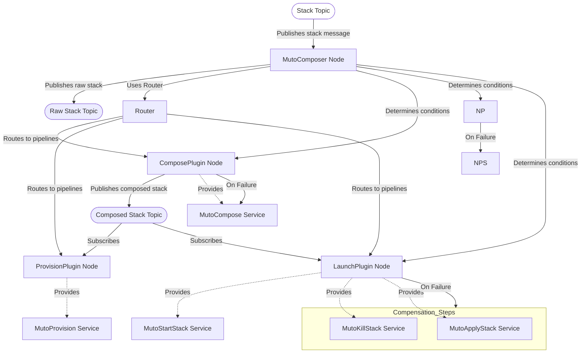

```mermaid
graph TD
    %% Nodes
    MC[MutoComposer Node]
    CP[ComposePlugin Node]
    PP[ProvisionPlugin Node]
    LP[LaunchPlugin Node]
    R[Router]
    S([Stack Topic])
    RS([Raw Stack Topic])
    CS([Composed Stack Topic])
    CPS[MutoCompose Service]
    PPS[MutoProvision Service]
    SPS[MutoStartStack Service]
    KPS[MutoKillStack Service]
    APS[MutoApplyStack Service]

    %% Styles
    style S fill: #ffffff

    %% Flow
    S -->|Publishes stack message| MC
    MC -->|Publishes raw stack| RS
    CP -->|Publishes composed stack| CS
    CS -->|Subscribes| PP
    CS -->|Subscribes| LP

    %% Services
    MC -->|Uses Router| R
    R -->|Routes to pipelines| CP
    R -->|Routes to pipelines| PP
    R -->|Routes to pipelines| LP

    %% Service Providers
    CP -.->|Provides| CPS
    PP -.->|Provides| PPS
    LP -.->|Provides| SPS
    LP -.->|Provides| KPS
    LP -.->|Provides| APS

    %% Compensation Subgraph
    subgraph Compensation_Steps
        KPS[MutoKillStack Service]
        APS[MutoApplyStack Service]
    end

    %% Compensation Flow
    CP -->|On Failure| CPS
    NP -->|On Failure| NPS
    LP -->|On Failure| Compensation_Steps

    %% Conditions
    MC -->|Determines conditions| CP
    MC -->|Determines conditions| NP
    MC -->|Determines conditions| LP

```
